## SCENARIO-1
## You are a data analyst at a food delivery platform. The operations team needs a report showing which restaurant partners earned more than Rs 1,00,000 in total revenue last month — but only for restaurants that received at least 50 orders

    SELECT restaurant_id,SUM(total_amount) AS total_revenue, COUNT(*) AS total_orders FROM orders WHERE order_date >= '2026-08-01' AND order_date 
    < '2026-09-01' GROUP BY restaurant_id HAVING SUM(total_amount) > 100000 AND COUNT(*) >= 50;

## Question: 
## Explain how you would use GROUP BY and HAVING together to produce this report.Why is HAVING more appropriate than WHERE for filtering on aggregated values? What would break in your query if you replaced HAVING with WHERE?

    - GROUP BY restaurant-wise orders ko group karta hai, SUM() total revenue aur COUNT() total orders calculate karta hai. HAVING aggregated values ko filter karta hai, isliye revenue > ₹1,00,000 aur orders ≥ 50 jaise conditions ke liye HAVING use hota hai. WHERE individual rows ko grouping se pehle filter karta hai, isliye WHERE SUM(...) use karne se query error degi.

## SCENARIO-2
## You are building a customer insights report for a food delivery app. The marketing team needs a list of every registered customer and their most recent order details — even for customers who have never placed an order.

    SELECT c.customer_id,c.customer_name,o.order_id,o.order_amount,o.order_date
    FROM Customers c LEFT JOIN (SELECT order_id,customer_id,order_amount,order_date,ROW_NUMBER() OVER(PARTITION BY customer_id ORDER BY order_date DESC) AS rn FROM Orders) o ON c.customer_id = o.customer_id AND o.rn = 1;

## Question: 
## Which type of JOIN would you use to ensure all customers appear in the result,including those with no orders? Justify your choice by comparing it with INNER JOIN, and explain specifically what data would be lost if INNER JOIN were used instead.

    - I would use a LEFT JOIN because it returns all customers, including those who have no orders. For customers without orders, the order columns will contain NULL. An INNER JOIN would return only customers who have matching orders, so customers with no orders would be excluded from the result.

## SCENARIO-3
## You are designing a delivery performance dashboard. The business wants to identify delivery agents whose average delivery time is faster than the overall platform average,without using a temporary table or creating a new view

    SELECT agent_id,AVG(delivery_time) AS agent_avg_time FROM Deliveries GROUP BY agent_id HAVING AVG(delivery_time) < (SELECT AVG(delivery_time)FROM Deliveries);

## Question:
## Describe how you would write a subquery to find these agents. What type ofsubquery is most appropriate here — scalar, row, or table — and why? What would happen if you tried to place this subquery in the SELECT clause instead of the WHERE clause?

    I would use a scalar subquery because the subquery returns a single value—the overall average delivery time. I would compare each agent's average with this value using HAVING. If the scalar subquery is placed in SELECT, it can work, but it only displays the overall average for each row; it does not filter out slower agents.
    
## SCENARIO-4
## You are analysing order data for a food delivery company. The product team wants to rank the top 3 highest-revenue restaurants within each city. Two restaurants in Surat have the exact same revenue figure and you must decide how to number them.

    SELECT id,location,revenue,DENSE_RANK() OVER(PARTITION BY location ORDER BY revenue DESC) AS revenue_rank FROM restaurant;

## Question: 
## Compare RANK() and DENSE_RANK() window functions for this use case. Which would you choose and why? Provide a brief example showing how each function would number three restaurants where two share the same revenue, and explain the practical impact of that difference on the product team's report.

    - RANK() tie ke baad rank skip karta hai, while DENSE_RANK() rank skip nahi karta. The choice depends on whether the report is intended to show ranking positions or the top distinct revenue levels.

## SCENARIO-5
## You are writing a CRM query for a food delivery startup. The customer success team wants each customer labelled as 'Platinum', 'Gold', or 'Standard' based on total lifetime spend — above Rs 5,000, between Rs 2,000 and Rs 5,000, and below Rs 2,000 respectively — directly in the query output without creating a new table.

    SELECT
    customer_id,
    total_spend,
    CASE
        WHEN total_spend > 5000 THEN 'Platinum'
        WHEN total_spend >= 2000 THEN 'Gold'
        ELSE 'Standard'
    END AS customer_tier
FROM CustomerSpending;

## Question:
## Explain how you would use CASE WHEN to generate this classification column. If a customer's total spend is exactly Rs 5,000, which tier will they fall into, and how does the order of your WHEN conditions control that outcome?

    - CASE WHEN can be used to create a customer tier directly in the query. Customers spending above ₹5,000 are Platinum, ₹2,000 to ₹5,000 are Gold, and below ₹2,000 are Standard. A customer spending exactly ₹5,000 falls into Gold because the Platinum condition uses > 5000, while the Gold condition uses >= 2000. CASE checks WHEN conditions from top to bottom, so the order of conditions matters.

## SCENARIO-6
## You are optimising a slow-running analytics query for a food delivery platform. The query joins four large tables and applies a GROUP BY across 10 million rows, taking over 30 seconds. A colleague suggests adding an index on the JOIN column used most frequently.
## Question:
## Explain what a database index does at the engine level and why it would speed up this specific query. Are there scenarios where adding an index could actually hurt performance? What trade-off must you evaluate before indexing every column in a large table?

    - An index is a data structure that helps the database engine locate rows efficiently without scanning the entire table. Indexing a frequently used JOIN column can reduce the amount of data the engine needs to scan and can make JOIN operations faster. However, indexes require storage and must be maintained whenever data is inserted, updated, or deleted. Therefore, indexing every column can improve some read operations but hurt write performance and increase storage. The trade-off is faster query performance versus storage and write-maintenance cost.

## Task 1: Menu & Order Explorer:

1. Create a table named food_orders with columns: order_id, customer_name,
   restaurant_name, item_ordered, quantity, price_per_item, order_date, and city. Insert at least 8 rows spanning at least 3 cities.

2. Write a query to retrieve all orders placed in the city of 'Mumbai',sorted by price_per_item in descending order.

    SELECT * FROM food_orders WHERE city = 'Mumbai' ORDER BY price_per_item DESC;

 
3. Write a query to return all distinct restaurant names that have received at least one order.

    SELECT DISTINCT restaurant_name FROM food_orders;
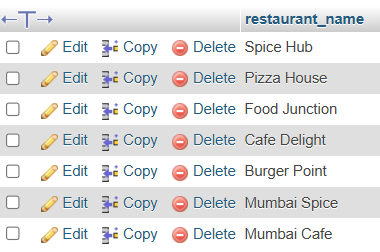

4. Write a query to list the top 5 most expensive individual orders using ORDER BY and LIMIT.

    SELECT * from food_orders order by price_per_item DESC LIMIT 5;
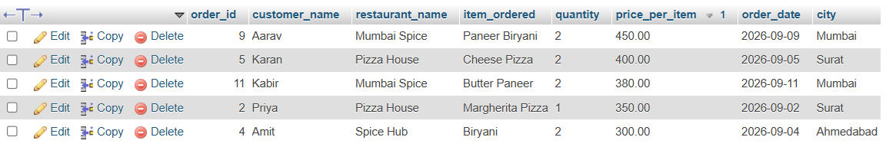

## Task 2: Restaurant Revenue Summary

1. Create a table named delivery_orders with columns: order_id, restaurant_name, city,total_amount, order_status, and order_date. Insert at least 10 rows covering at least 4 different restaurants.

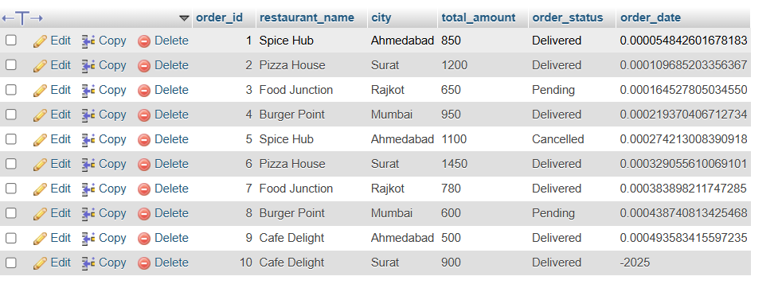

2. Write a query using SUM, COUNT, and AVG to calculate total revenue, total orders, and average order value per restaurant.

    SELECT restaurant_name,SUM(total_amount) AS total_revenue,COUNT(order_id) AS total_orders,AVG(total_amount) AS average_order_value FROM delivery_orders GROUP BY restaurant_name;
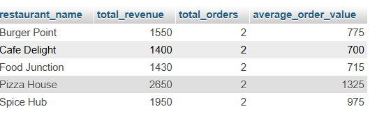

3. Add a HAVING clause to return only restaurants whose total revenue exceeds Rs 5,000

    SELECT restaurant_name,SUM(total_amount) AS total_revenue,COUNT(order_id) AS total_orders,AVG(total_amount) AS average_order_value FROM delivery_orders GROUP BY restaurant_name HAVING SUM(total_amount) > 5000;
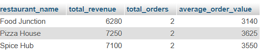

4. Extend the SELECT list with a CASE WHEN expression that labels each qualifying restaurant as 'High Revenue' if total revenue is above Rs 10,000, or 'Moderate Revenue' otherwise.

    SELECT restaurant_name,SUM(total_amount) AS total_revenue,COUNT(order_id) AS total_orders,AVG(total_amount) AS average_order_value, CASE WHEN SUM(total_amount) > 10000 THEN 'High Revenue' ELSE 'Moderate Revenue' END AS revenue_category FROM delivery_orders GROUP BY restaurant_name HAVING SUM(total_amount) > 5000;
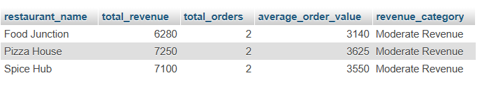

## Task 3: Customer–Order–Restaurant Joined Report

1. Create three tables: customers (customer_id, name, city, phone), restaurants (restaurant_id,name, cuisine_type, city), and orders (order_id, customer_id, restaurant_id, amount,order_date). Insert at least 6 rows per table and intentionally include at least 2 customers who have placed no orders.

    CREATE TABLE customers (
    customer_id INT PRIMARY KEY,
    name VARCHAR(100),
    city VARCHAR(50),
    phone VARCHAR(15)
    );

    INSERT INTO customers (customer_id, name, city, phone) VALUES (101, 'Rahul', 'Ahmedabad', '9876543210'), (102, 'Priya', 'Surat', '9876543211'), (103, 'Neha', 'Rajkot', '9876543212'), (104, 'Amit', 'Mumbai', '9876543213'), (105, 'Riya', 'Ahmedabad', '9876543214'), (106, 'Karan', 'Surat', '9876543215');

    CREATE TABLE restaurants (
    restaurant_id INT PRIMARY KEY,
    name VARCHAR(100),
    cuisine_type VARCHAR(50),
    city VARCHAR(50)
    );

    INSERT INTO restaurants (restaurant_id, name, cuisine_type, city) VALUES (201, 'Spice Hub', 'Indian', 'Ahmedabad'), (202, 'Pizza House', 'Italian', 'Surat'), (203, 'Food Junction', 'Chinese', 'Rajkot'), (204, 'Burger Point', 'Fast Food', 'Mumbai'), (205, 'Cafe Delight', 'Cafe', 'Ahmedabad'), (206, 'Royal Biryani', 'Indian', 'Surat');

    CREATE TABLE orders (
    order_id INT PRIMARY KEY,
    customer_id INT,
    restaurant_id INT,
    amount DECIMAL(10,2),
    order_date DATE
    );

    INSERT INTO orders (order_id, customer_id, restaurant_id, amount, order_date) VALUES (1, 101, 201, 850.00, '2026-09-01'), (2, 101, 202, 1200.00, '2026-09-03'), (3, 102, 202, 650.00, '2026-09-04'), (4, 102, 206, 900.00, '2026-09-06'), (5, 103, 203, 750.00, '2026-09-07'), (6, 104, 204, 1100.00, '2026-09-08'), (7, 103, 203, 500.00, '2026-09-10'), (8, 104, 201, 950.00, '2026-09-11');

2. Write an INNER JOIN query to list each order alongside the placing customer's name and the fulfilling restaurant's name.

    SELECT o.order_id, c.name AS customer_name, r.name AS restaurant_name, o.amount, o.order_date FROM orders o INNER JOIN customers c ON o.customer_id = c.customer_id INNER JOIN restaurants r ON o.restaurant_id = r.restaurant_id;
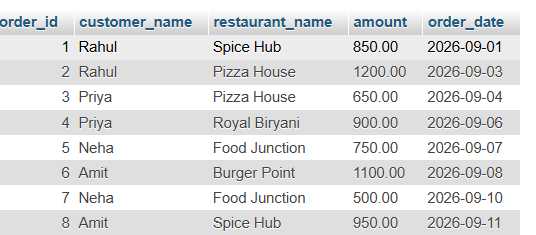

3. Write a LEFT JOIN query to list all customers — including those with no orders — with NULL appearing in order columns where no order exists.

    SELECT c.customer_id, c.name AS customer_name, c.city, o.order_id, o.amount, o.order_date FROM customers c LEFT JOIN orders o ON c.customer_id = o.customer_id;
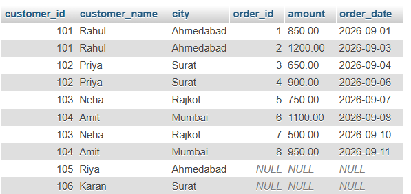

4. Add a WHERE condition to the joined result to show only orders where both the customer and the restaurant belong to the same city.

    SELECT o.order_id, c.name AS customer_name, c.city AS customer_city, r.name AS restaurant_name, r.city AS restaurant_city, o.amount, o.order_date FROM orders o INNER JOIN customers c ON o.customer_id = c.customer_id INNER JOIN restaurants r ON o.restaurant_id = r.restaurant_id WHERE c.city = r.city;
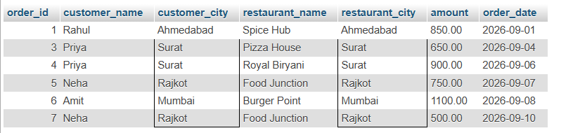

## Task 4: Delivery Agent Performance Ranking

1. Create a table named deliveries with columns: delivery_id, agent_name, restaurant_name,delivery_time_mins, and order_date. Insert at least 10 rows across at least 4 delivery agents,with varied delivery times.

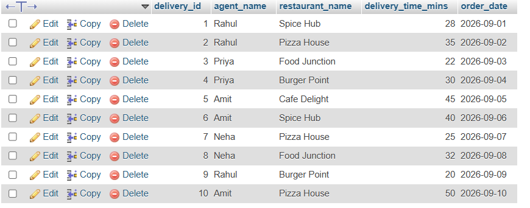

2. Write a CTE named agent_stats that calculates each agent's average delivery time across all their deliveries.

    WITH agent_stats AS ( SELECT agent_name, AVG(delivery_time_mins) AS avg_delivery_time FROM deliveries GROUP BY agent_name ) SELECT * FROM agent_stats;
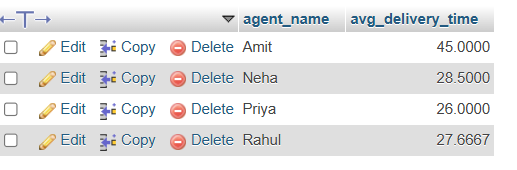

3. Using the CTE result, apply RANK() OVER (ORDER BY avg_delivery_time ASC) to rank agents from fastest to slowest.

    WITH agent_stats AS ( SELECT agent_name, AVG(delivery_time_mins) AS avg_delivery_time FROM deliveries GROUP BY agent_name ) SELECT agent_name, avg_delivery_time, RANK() OVER ( ORDER BY avg_delivery_time ASC ) AS agent_rank FROM agent_stats;
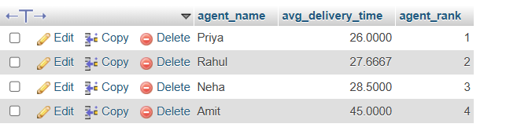

4. Add a scalar subquery to compute the overall platform average delivery time, then use CASE WHEN in the final SELECT to label each agent 'On Track' if their average is at or below the platform average, or 'Needs Improvement' if it is above.

    WITH agent_stats AS ( SELECT agent_name, AVG(delivery_time_mins) AS avg_delivery_time FROM deliveries GROUP BY agent_name ) SELECT agent_name, avg_delivery_time, ( SELECT AVG(delivery_time_mins) FROM deliveries ) AS platform_avg_time, CASE WHEN avg_delivery_time <= ( SELECT AVG(delivery_time_mins) FROM deliveries ) THEN 'On Track' ELSE 'Needs Improvement' END AS performance_status FROM agent_stats ORDER BY avg_delivery_time ASC;
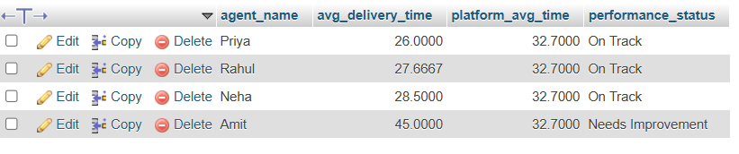